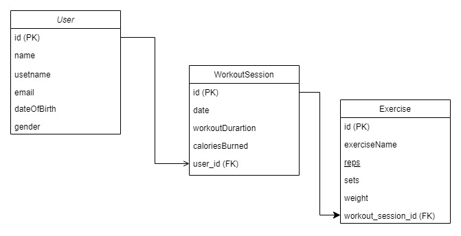

# Sanity Fitness Backend Application

## Overview

The Fitness Backend Application is a RESTful web service built with Java and Spring Boot, designed to manage user fitness data, workout sessions, and exercises. This application supports basic CRUD (Create, Read, Update, Delete) operations for users, workout sessions, and exercises. It leverages a MySQL database for data persistence and implements JPA inheritance to manage different types of workout sessions.
## Features

- REST API following best practices.
- CRUD operations for users, workout sessions, and exercises.
- MySQL database integration.
- JPA inheritance for extending entity relationships.
- Robust error handling.
- Unit and integration tests.
- Deployed on GitHub.

## Technologies Used

- Java
- Spring Boot
- Spring Data JPA
- MySQL
- JUnit

## Architecture

The application consists of three main entities: `User`, `WorkoutSession`, and `Exercise`. The `User` entity represents users of the application, while the `WorkoutSession` entity captures details of individual workout sessions, and the `Exercise` entity represents individual exercises within a workout session.
## UML Class Diagram

### Entities

#### User

- `id` (Primary Key)
- `name`
- `username`
- `email`
- `dateOfBirth`
- `gender`

#### Workout Session

- `id` (Primary Key)
- `date`
- `workoutDuration`
- `caloriesBurned`
- `user_id` (Foreign Key)

#### Exercise 

- `id` (Primary Key)
- `name`
- `reps`
- `sets`
- `weight`
- `workout_session_id` (Foreign Key)
